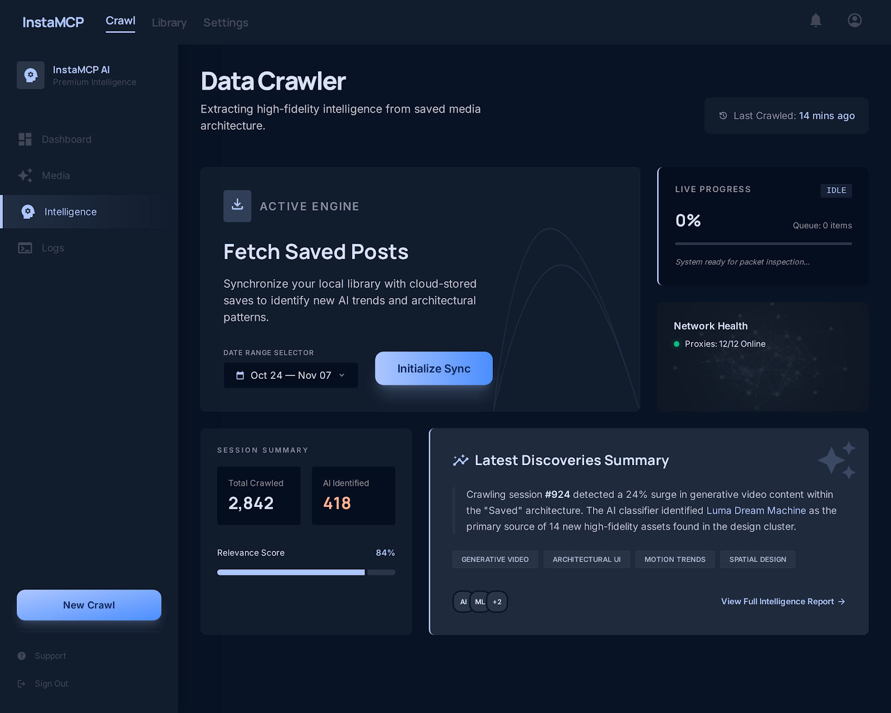
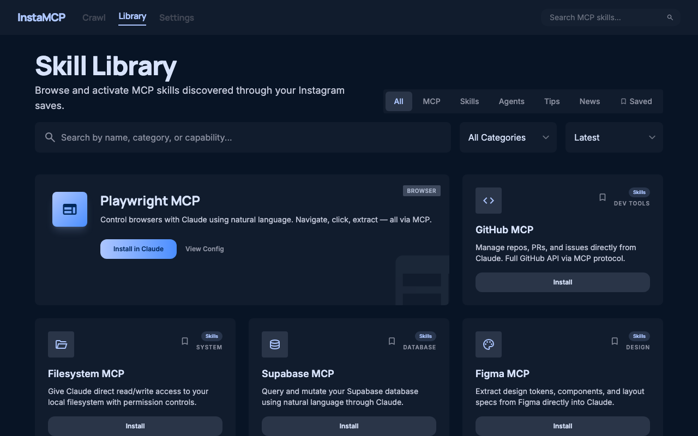

# InstaMCP — Instagram Saved Posts AI Crawler

> ⚠️ **WIP — vibe-coded.** This project is actively being built in the open. Expect rough edges.

A web app that crawls your Instagram saved posts, uses AI to filter out MCP servers and AI skills, and exposes them via an MCP server so Claude can tell you what to install — without manually scrolling through hundreds of saves.

---

## Screenshots

| Crawl Dashboard | Skill Library |
|---|---|
|  |  |

---

## What it does

1. **Crawls** your Instagram saved posts using a Playwright-based session scraper — including post captions, hashtags, and community comments
2. **Classifies** each post with AI — filtering for MCP servers, Claude tools, AI frameworks, dev tools, and prompting techniques
3. **Extracts pros & cons** from captions and real community comments for each tool
4. **Surfaces** results in a clean web dashboard with a detail modal (pros, cons, community feedback, Claude Desktop config)
5. **Exposes** findings via a local MCP server so you can ask Claude directly: *"what AI tools have I saved?"*

---

## Stack

- **Frontend** — vanilla HTML/CSS/JS with Tailwind CDN
- **Backend** — Node.js + Express
- **Scraper** — Playwright (headless Chromium)
- **AI** — OpenRouter (free cloud, any model) or Ollama (on-device, no API key)
- **MCP** — `@modelcontextprotocol/sdk`

---

## Getting started

### Prerequisites

- Node.js 18+
- An Instagram account with saved posts
- An [OpenRouter API key](https://openrouter.ai) (free tier available) — or Ollama running locally (no key needed)

### Install

```bash
# Server
cd server && npm install
npx playwright install chromium

# MCP server
cd ../mcp-server && npm install
```

### Run

```bash
cd server && npm start
# → http://localhost:3000
```

Open the app, go to **Settings**, add your Instagram credentials and OpenRouter API key (or select an Ollama model), then hit **Initialize Sync** on the Crawl page.

---

## MCP server setup

Add to your `~/Library/Application Support/Claude/claude_desktop_config.json`:

```json
{
  "mcpServers": {
    "instamcp": {
      "command": "node",
      "args": ["/path/to/insta saved list ai crawler/mcp-server/index.js"]
    }
  }
}
```

Then restart Claude Desktop. You can now ask:
- *"What AI tools have I saved on Instagram?"*
- *"Search my saves for Supabase"*
- *"Give me a summary of my last crawl"*

---

## Security notes

- Instagram credentials are stored in `localStorage` in your browser only — never sent to any third party
- Session cookies are saved locally in `session.json` — gitignored
- Crawl results are saved in `results.json` — gitignored
- Your OpenRouter API key is passed directly from browser to your local server — never leaves your machine

---

## Project structure

```
├── web/              # Frontend (Crawl dashboard, Skill library, Settings)
├── server/           # Express backend + Instagram scraper + AI classifier
├── mcp-server/       # MCP server exposing skills to Claude
└── .env.example      # Env var template
```

---

## Roadmap

- [x] Web UI (Crawl dashboard, Skill library, Settings)
- [x] Backend server + SSE progress streaming
- [x] Instagram Playwright scraper (captions, hashtags, comments)
- [x] AI classifier via OpenRouter or Ollama
- [x] Pros/cons extraction from captions + community comments
- [x] Detail modal with pros, cons, community feedback, Claude Desktop config
- [x] MCP server with 3 tools
- [x] Date range filtering, saved bookmarks, type tabs (MCP / Skills / Agents / Tips / News)
- [ ] Auth persistence across restarts
- [ ] Scheduled auto-crawl
- [ ] Export to markdown / Notion
- [ ] Deploy to Railway / Render

---

*Built with Claude Code.*
